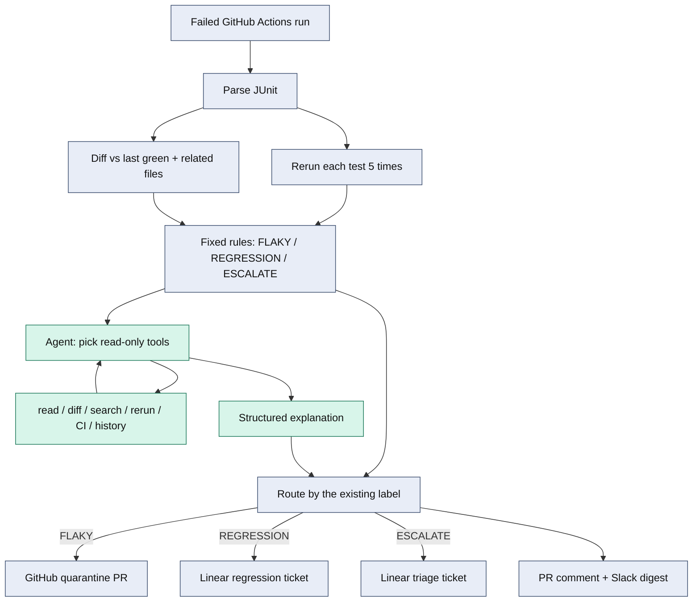

# Syft

## Project overview

Syft is an agent that triages a failed CI run and then acts in GitHub, Linear, and Slack. After each failing test is labeled, the agent can choose tools: read source at the failing commit, diff it against last green, search the tree, fetch one rerun's output, inspect the GitHub Actions workflow, and look up prior Syft labels. It batches those calls, writes an explanation, and stops at five turns, eight tool calls, or 60 seconds.

The differentiator is what that agent is not allowed to choose. CI fails for different reasons: a flake, a real regression, or not enough evidence. The costly mistake is skipping a real regression as if it were flaky. Fixed rules set `FLAKY`, `REGRESSION`, and `ESCALATE`. The model's output schema has no classification field, so a tool call cannot change the label. Routing follows the label: quarantine PR, Linear ticket, or triage ticket, plus one PR comment and one Slack digest.

The pipeline has three stages. Only the middle one is the agent.

1. **Deterministic evidence and label.** Syft pulls the failed GitHub Actions run, parses JUnit, reruns each failing test five times, diffs against last green, and applies the rules. Label and confidence are finished before any model call.
2. **Agent loop.** The model may call the read-only tools above and write an explanation. Caps: five turns, eight tool calls, 60 seconds. If it hits a cap or errors, Syft falls back to a template explanation. The label does not change.
3. **Deterministic routing.** `FLAKY` opens a quarantine PR. `REGRESSION` opens a Linear issue. `ESCALATE` opens a Linear triage issue. Every run also gets one PR comment and one Slack digest.

Credential-safe structured logs record every investigation turn, tool call, safe argument, and duration without dumping tool output.



Gray is deterministic. Green is the agent loop.

## External apps

Syft connects to three apps:

| App | What Syft does |
| --- | --- |
| GitHub | Reads failed runs and JUnit artifacts. Opens a quarantine PR for flaky tests. Posts one evidence comment on the branch PR. |
| Linear | Opens a regression issue or a needs-triage issue. Never edits product code for those cases. |
| Slack | Posts one digest with counts, labels, and links. |

## Demo

Two-minute demo: **[[add the public video URL here]](https://youtu.be/vsZHP6MPt4I)**

## How we tested reliability

The check we care about most: a real regression must never be labeled `FLAKY`.

- The pytest suite runs on every PR and on `main`, on Python 3.12 and 3.14.
- A 15-case, hand-labeled classifier benchmark covers mixed reruns, always-fail cases, timeouts, missing evidence, and mixed signals. CI fails if any case is wrong or if any regression is labeled flaky. Current result: 15/15 correct, zero regressions labeled flaky.
- A live fixture repo (`GreenTreeGaming/syft-testing`) had three known failures in one workflow: one flake, one checkout regression, one unclear environment failure. Syft labeled them `FLAKY`, `REGRESSION`, and `ESCALATE`. The quarantine PR skipped only the flake. The other two stayed failing.
- The model output schema has no `classification` or `confidence` field, so a bad explanation cannot relabel a test.

Longer writeup: [system and reliability brief](docs/system-reliability-brief.md).

## Setup

Python 3.12 or newer is required.

```bash
cd /path/to/syft
python3.12 -m venv .venv
source .venv/bin/activate
python -m pip install -e '.[dev]'
```

Copy the env example and fill in the keys you need. Unit tests do not need credentials.

```bash
cp .env.example .env
```

Set `GITHUB_TOKEN` and `GITHUB_REPOSITORY=owner/repo` when using GitHub run discovery.

## Run the complete hackathon demo

With the maintained `syft-testing` fixture cloned beside this repository, put the GitHub, OpenAI, Linear, and Slack credentials in the gitignored `.env` file. The demo command loads those known settings automatically without overriding values already present in the shell. Then launch the full three-app workflow with one command:

```bash
python -m syft demo
```

The demo command discovers the maintained failed workflow, performs five isolated reruns, runs the bounded OpenAI investigation, executes the GitHub, Linear, and Slack actions, records SQLite history, and saves traces and JSON in a fresh temporary workspace. Because `demo` performs real external writes, use `python -m syft demo --dry-run` for a no-write rehearsal. Use `--repo /path/to/syft-testing` only when the fixture repository is not cloned beside Syft.

## Run an analysis

```bash
python -m syft \
  tests/test_checkout.py::test_checkout \
  --repo /path/to/fixture-repository \
  --current-commit f8a2391 \
  --last-green-commit a42db91
```

The command prints compact consumer JSON and writes a full sanitized evidence trace beneath `<repo>/traces/`. The compact JSON retains attempt outcomes, durations, and exit codes but omits repeated raw pytest output. Omit `--current-commit` to use `HEAD`. Use `--skip-previous-check` when the last-green worktree cannot run in the local environment; this leaves prior behavior as `null` rather than inventing evidence.

Do not copy `/path/to/fixture-repository` literally; replace it with a real checkout. The maintained fixture can be run with:

```bash
.venv/bin/python -m syft \
  tests/test_checkout.py::test_checkout \
  --repo /path/to/syft-testing \
  --current-commit f29ac136363632d73a16afc45576ab83af7978d2 \
  --last-green-commit 4deaeab237d31edd88ba473cb6b551fb74cc71d5 \
  --github-repository GreenTreeGaming/syft-testing \
  --branch codex/regression-fixture \
  --workflow-run-id 34770710053 \
  --workflow-name CI \
  --artifact-name pytest-junit
```

Run this as your normal user. `sudo` selects a different Python environment and is unnecessary.

Library usage:

```python
from pathlib import Path

from syft.deterministic.pipeline import analyze_failed_test

analysis = analyze_failed_test(
    repo_path=Path("/path/to/repo"),
    test_node_id="tests/test_checkout.py::test_checkout",
    current_commit="f8a2391",
    last_green_commit="a42db91",
)
print(analysis.model_dump_json(indent=2))
```

Use `analysis.consumer_dump_json(indent=2)` for the compact Person B contract. `model_dump_json()` retains complete rerun output for auditing and trace persistence.

## Discover workflow evidence

```python
from pathlib import Path

from syft.deterministic.github_runs import GitHubActionsClient

with GitHubActionsClient.from_environment() as github:
    failed = github.latest_failed_run(branch="main")
    previous_green = github.previous_successful_run(failed, branch="main")
    artifact = github.download_junit_artifact(failed.id, Path("artifacts"))
```

## Analyze the latest failed workflow automatically

Export GitHub configuration without placing the token in source control, then run the coordinator:

```bash
export GITHUB_TOKEN="$(gh auth token)"
export GITHUB_REPOSITORY="GreenTreeGaming/syft-testing"

python -m syft poll \
  --repo /path/to/syft-testing \
  --branch codex/regression-fixture \
  --green-branch main \
  --artifact-name pytest-junit \
  --ground-truth /path/to/syft-testing/eval/ground_truth.json
```

The coordinator discovers the newest failed run, finds the prior successful run, downloads its JUnit artifact, analyzes every failed test from a detached checkout, writes full traces, and prints a compact `WorkflowAnalysis` JSON envelope. When `--ground-truth` is provided, the confusion matrix and regression safety metrics are printed to stderr.

## Watch for new CI failures

Watch mode turns the same deterministic pipeline and action agent into a long-running worker:

```bash
export GITHUB_TOKEN="$(gh auth token)"

python -m syft watch \
  --repo /path/to/syft-testing \
  --github-repository GreenTreeGaming/syft-testing \
  --branch codex/regression-fixture \
  --green-branch main \
  --artifact-name pytest-junit \
  --interval 60 \
  --dry-run
```

Use `--once` for one scheduler-friendly cycle. Dry runs and real executions have separate processed-run records, so a rehearsal never suppresses a later `--execute` run. Successful cycles save `analysis.json` and `agent-run.json` beneath `.syft/runs/<workflow-run-id>/`; these are the zero-secret inputs for the standalone HTML reporter. `.syft/watch-state.json` prevents repeat processing, while the existing action ledger prevents duplicate GitHub, Linear, and Slack writes after partial retries.

Every classified workflow is idempotently recorded in `.syft/history.sqlite3` before actions run. Historical context is then attached to the saved agent run, GitHub PR summary, and Slack digest. It is supporting evidence only: history never changes the deterministic classification or confidence. Use `--history-db` to choose another database and `--history-limit` to bound per-test context.

To run the complete worker with real actions and optional OpenAI explanations:

```bash
export OPENAI_API_KEY="..."
export LINEAR_API_KEY="..."
export LINEAR_TEAM_ID="..."
export SLACK_WEBHOOK_URL="https://hooks.slack.com/services/..."

python -m syft watch \
  --repo /path/to/tested/repository \
  --github-repository owner/repo \
  --branch main \
  --artifact-name pytest-junit \
  --use-openai \
  --execute
```

If a cycle hits a temporary API or integration failure, watch mode logs a credential-safe error and retries on the next interval. A run is marked processed only after its analysis, actions, and saved JSON all complete. Press `Ctrl-C` to stop the worker cleanly.

## Run tests

```bash
python -m pytest
```

Pull requests and pushes to `main` run the complete suite on Python 3.12 and 3.14. CI also executes a 15-case, hand-labeled boundary benchmark:

```bash
python -m syft.eval.benchmark --input eval/classifier_benchmark.json
```

The benchmark covers mixed reruns, persistent failures, conflicting prior-commit evidence, related-code conflicts, timeouts, missing evidence, and all-pass reruns. It fails the process if any expected label is missed or if any regression false negative occurs. The separate fixture-repository evaluation remains the end-to-end check against real pytest, Git, and GitHub Actions evidence.

## Run the action agent

The agent consumes compact `WorkflowAnalysis` JSON. Dry run is the default and performs no GitHub, Linear, or Slack writes:

```bash
python -m syft agent --input /tmp/syft-analysis.json
```

To let OpenAI generate structured explanations while still keeping every external action in dry-run mode:

```bash
export OPENAI_API_KEY="..."
export OPENAI_MODEL="gpt-5.4-mini"

python -m syft agent \
  --input /tmp/syft-analysis.json \
  --repo /path/to/tested/repository \
  --use-openai
```

The model's Structured Output schema intentionally has no `classification` or `confidence` field. It can explain evidence and propose a hypothesis, but the pure router always copies the deterministic classification into its action plan.

Real external actions require the explicit `--execute` flag and all integration credentials:

```bash
export GITHUB_TOKEN="$(gh auth token)"
export LINEAR_API_KEY="..."
export LINEAR_TEAM_ID="..."
export SLACK_WEBHOOK_URL="https://hooks.slack.com/services/..."

python -m syft agent \
  --input /tmp/syft-analysis.json \
  --repo /path/to/tested/repository \
  --use-openai \
  --execute
```

Routing is fixed:

- `FLAKY` creates a stacked quarantine PR against the failed branch.
- `REGRESSION` creates a Linear regression issue and never modifies code.
- `ESCALATE` creates a Linear needs-triage issue.
- One GitHub pull-request comment summarizes the evidence and links to those actions. Reprocessing updates the marked comment instead of creating another one; branches without an open PR are skipped safely.
- One Slack digest summarizes the workflow and links to created actions.

`.syft-agent-state.json` records successful action IDs so rerunning the same workflow does not duplicate actions. The GitHub branch and PR lookup provide an additional external idempotency check.

## Classification rules

- Mixed passes and failures, with no directly related source change: `FLAKY`.
- Every rerun fails and directly related source changed: `REGRESSION`, unless prior-commit behavior conflicts.
- Missing evidence, timeouts, all-pass reruns, or conflicting signals: `ESCALATE`.

`REGRESSION -> FLAKY` is treated as the highest-risk classification mistake.

## Current limitations

- Related-code analysis follows direct imports only; it is intentionally not a full dependency graph.
- Previous-commit execution assumes the active Python environment can run that revision.
- GitHub artifact selection uses an explicit name or common JUnit artifact naming conventions.
- Confidence values are explainable rule scores, not statistical probabilities.
