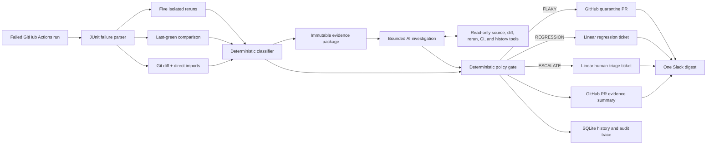

# Syft makes CI triage safer by refusing uncertain classifications

## Executive summary

- Syft deterministically classified a live three-failure workflow into one flaky test, one regression, and one human escalation, then created the correct GitHub, Linear, and Slack actions.
- The safety-critical result is **zero regressions classified as flaky** in both the live fixture evaluation and a 15-case boundary benchmark.
- The LLM is outside the decision boundary: it receives an immutable classification and produces only a structured explanation, hypothesis, evidence list, and recommendation.
- Syft deliberately escalates incomplete or conflicting evidence instead of guessing. Its current direct-import analysis is useful but not a complete dependency graph.

## Why this split matters

Silently quarantining a real regression is the dangerous failure mode in automated CI triage. Syft therefore does not ask a language model whether a test is flaky. It gathers reproducible evidence, applies fixed rules, and permits the model to explain the decision only after the label and confidence are set.



## Deterministic decision policy

| Observed evidence | Decision | Why |
|---|---|---|
| Mixed pass/fail reruns and no related implementation change | `FLAKY` | The same commit produces inconsistent outcomes without a directly related change. |
| Every rerun fails, related implementation changed, and the test passed at last green | `REGRESSION` | Persistent new failure aligns with a relevant code change. |
| Timeouts, missing evidence, all-pass reruns, prior-commit conflict, or mixed reruns plus a related change | `ESCALATE` | The evidence does not safely distinguish flakiness from a product or environment defect. |

Confidence values are explainable rule scores, not calibrated probabilities.

## Evidence from the live fixture

The controlled `GreenTreeGaming/syft-testing` workflow run `34771488723` contained three simultaneous failures with known ground truth.

| Test | Ground truth | Syft result | Key evidence | Action |
|---|---|---|---|---|
| `test_cache_warmup_race` | Flaky | `FLAKY` at 0.91 | Two of five reruns passed; no directly related implementation file changed. | [Quarantine PR #2](https://github.com/GreenTreeGaming/syft-testing/pull/2) |
| `test_checkout` | Regression | `REGRESSION` at 0.97 | Zero of five reruns passed; last green passed; `app/checkout.py` changed; expected 108.00, received 92.00. | [Linear SYF-6](https://linear.app/syft-demo/issue/SYF-6/syft-regression-test-checkout) |
| `test_unexplained_environment_failure` | Ambiguous | `ESCALATE` at 0.70 | Zero of five reruns passed, but no directly related implementation change explained the failure. | [Linear SYF-5](https://linear.app/syft-demo/issue/SYF-5/syft-needs-triage-test-unexplained-environment-failure) |

Observed end-to-end result: **3/3 correct, 100% accuracy, zero regression false negatives, and zero regressions classified as flaky**. The generated quarantine PR changed one test file only. Its follow-up CI run skipped the flaky test while leaving the regression and ambiguous failure visible.

## Boundary benchmark

The repository also contains 15 hand-labeled classifier boundary cases. They exercise different rerun balances, persistent failures, timeouts, absent related-code evidence, conflicting previous-commit behavior, and all-pass reruns.

| Expected label | Correct | Incorrect |
|---|---:|---:|
| `FLAKY` | 4 | 0 |
| `REGRESSION` | 2 | 0 |
| `ESCALATE` | 9 | 0 |
| **Total** | **15** | **0** |

This benchmark achieved **15/15 correct with zero regression false negatives**. It is a designed boundary test, not a claim of production-wide statistical accuracy. The separate three-test fixture exercises the complete path through pytest, Git, GitHub Actions artifacts, classification, LLM explanation, and external actions.

## Reliability controls

- **Fail-safe ambiguity:** unsupported signal combinations route to a human.
- **Schema boundary:** the LLM output schema contains no classification or confidence field.
- **Exact-commit context:** explanations read bounded test and related source files from the failed commit.
- **Auditable traces:** every analysis has an ID, commit evidence, rerun summary, reason, and sanitized trace.
- **Compact handoff:** repeated raw pytest output stays in trace files rather than downstream tickets.
- **Idempotent actions:** stable action IDs, a local atomic ledger, and GitHub branch lookup prevent duplicate work.
- **Explicit writes:** external mutations require `--execute`; dry-run is the default.
- **Secret hygiene:** integration credentials come from environment variables, and HTTP request URL logging is suppressed to protect webhook secrets.
- **Continuous verification:** pull requests run the full suite and benchmark on Python 3.12 and 3.14.

## Known limitations

- Related-code detection currently follows direct Python imports, not a full runtime dependency graph.
- Five reruns provide useful evidence but cannot prove that a rare intermittent failure will never recur.
- Previous-commit execution assumes that revision can run in the active Python environment.
- Confidence scores express rule strength; they are not learned or statistically calibrated.
- The current evaluation set is intentionally small and controlled. The next meaningful validation step is replaying historical failures from multiple real repositories.

## Reproduce the safety result

```bash
python -m pytest
python -m syft.eval.benchmark --input eval/classifier_benchmark.json
```

Expected headline results:

```text
46 tests passed
Total: 15
Correct: 15
Accuracy: 100.0%
Regression false negatives: 0
REGRESSION -> FLAKY: 0
```
